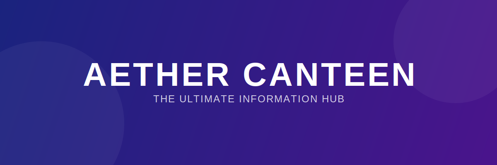

# 🌌 Aether Canteen



<div align="center">

**A premium, high-performance portal for real-time updates and essential digital tools.**

[](https://vuejs.org/)
[](https://www.typescriptlang.org/)
[](https://vitejs.dev/)
[](./LICENSE)

[Explore Features](#-key-features) • [Installation](#-quick-start) • [Contribution](#-how-to-contribute)

</div>

---

## ✨ Overview

**Aether Canteen** (formerly Ceobe Canteen) is a sophisticated web-based hub designed to centralize information, news, and utility tools into a single, seamless interface. Whether you are tracking real-time updates or utilizing specialized digital instruments, Aether provides a fluid and aesthetically pleasing experience across all devices.

### 🖼️ Visual Showcase

<div align="center">
  
  <p><em>Experience a modern, minimalist interface designed for speed and clarity.</em></p>
</div>

---

## 🚀 Key Features

- **🌐 Multi-Platform Support**: Seamlessly transitions between Desktop, Mobile, and Browser Extension versions.
- **⚡ Real-time News Engine**: "Cookie" source integration for instant notifications on the latest updates.
- **🛠️ Integrated Toolbelt**: A suite of custom-built tools accessible directly from your terminal or dashboard.
- **🎨 Glassmorphic Design**: Modern UI/UX with smooth transitions and a premium aesthetic.
- **📱 Responsive Layout**: Fully optimized for everything from ultra-wide monitors to mobile screens.

---

## 🛠️ Tech Stack

Aether Canteen is built with the latest industry-standard technologies focused on performance and maintainability:

- **Frontend**: [Vue 3](https://vuejs.org/) with Composition API
- **Styling**: [Sass/SCSS](https://sass-lang.com/) & [Vuetify 3](https://next.vuetifyjs.com/)
- **State Management**: [Vuex 4](https://next.vuex.vuejs.org/)
- **Routing**: [Vue Router 4](https://next.router.vuejs.org/)
- **Build Tool**: [Vite](https://vitejs.dev/) / Vue CLI
- **Language**: [TypeScript](https://www.typescriptlang.org/)

---

## 📥 Quick Start

To get a local copy up and running, follow these simple steps:

### Prerequisites
- Node.js (v16+)
- npm or yarn

### Installation
1. Clone the repository
   ```bash
   git clone https://github.com/your-username/aether-canteen.git
   ```
2. Install dependencies
   ```bash
   npm install
   ```
3. Launch development server
   ```bash
   npm run serve
   ```
4. Build for production
   ```bash
   npm run build
   ```

---

## 📂 Project Structure

```text
src/
├── assets/          # Shared assets, styles, and fonts
├── components/      # Reusable Vue components
├── request/         # API and network configurations
├── router/          # Application routing logic
├── store/           # Global state management (Vuex)
├── views/           # Top-level page components
└── App.vue          # Root application component
```

---

## 🤝 How to Contribute

We welcome contributions! Please feel free to submit a Pull Request or open an issue for any bugs or feature requests.

1. Fork the Project
2. Create your Feature Branch (`git checkout -b feature/AmazingFeature`)
3. Commit your Changes (`git commit -m 'Add some AmazingFeature'`)
4. Push to the Branch (`git push origin feature/AmazingFeature`)
5. Open a Pull Request

---

<div align="center">
  <p>© 2024 Aether Canteen. Designed with 💙 for the community.</p>
</div>
